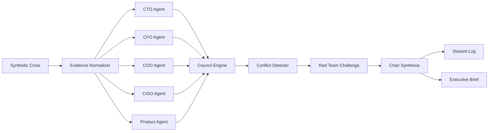

# Architecture

```mermaid
flowchart LR
  A[Synthetic Crisis] --> B[Evidence Normalizer]
  B --> C1[CTO Agent]
  B --> C2[CFO Agent]
  B --> C3[COO Agent]
  B --> C4[CISO Agent]
  B --> C5[Product Agent]
  C1 --> D[Council Engine]
  C2 --> D
  C3 --> D
  C4 --> D
  C5 --> D
  D --> E[Conflict Detector]
  E --> F[Red Team Challenge]
  F --> G[Chair Synthesis]
  G --> H[Dissent Log]
  G --> I[Executive Brief]
```
